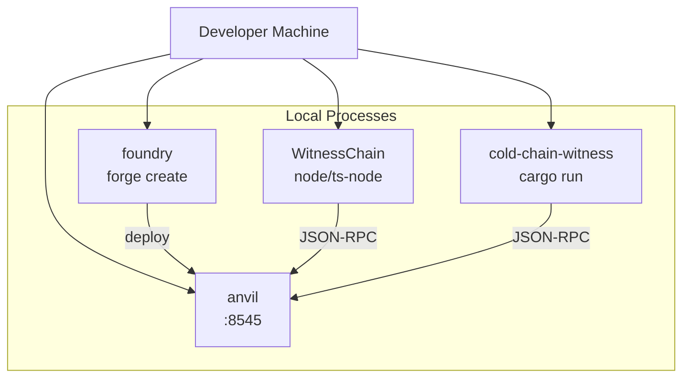
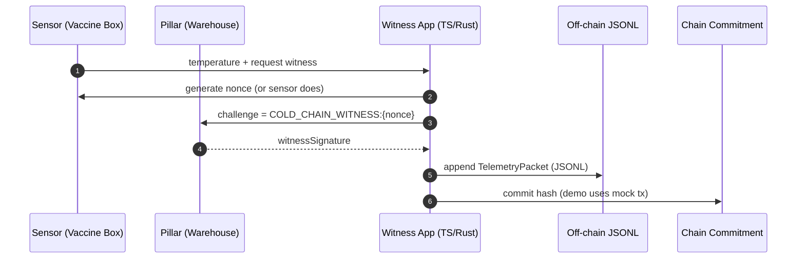
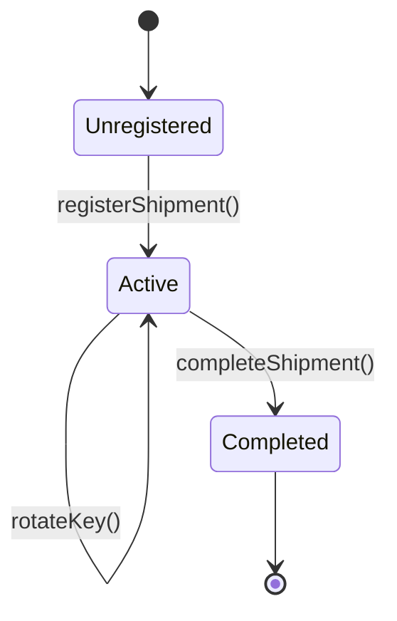

# Architecture — Cold Chain Witness (HLD + LLD)

**Date:** 2025-12-19  
**Scope:** End-to-end architecture across:

- Rust witness simulator: `cold-chain-witness/`
- Solidity smart contracts: `SupplyChain/`
- TypeScript witness app: `WitnessChain/`

This document provides:

- **HLD (High-Level Design):** system context, major components, trust boundaries, runtime/deployment view, and end-to-end flows.
- **LLD (Low-Level Design):** module-level behavior, message formats, signatures, on-chain data models and interfaces, and implementation notes aligned with the current code.

Related docs:

- Continuous heartbeat loop details: [cold-chain-witness/HEARTBEAT_ARCHITECTURE.md](cold-chain-witness/HEARTBEAT_ARCHITECTURE.md)
- Rust blockchain integration guide: [cold-chain-witness/BLOCKCHAIN_INTEGRATION.md](cold-chain-witness/BLOCKCHAIN_INTEGRATION.md)
- SupplyChain notes: [SupplyChain/SUPPLYCHAIN.md](SupplyChain/SUPPLYCHAIN.md)

---

## 1) Problem & Goals

### 1.1 Problem

Cold-chain shipments (e.g., vaccines) require continuous temperature and custody assurance. Regulators and stakeholders need:

- **Integrity:** the data should be tamper-evident.
- **Custody traceability:** handovers should be attestable by trusted infrastructure.
- **Forward secrecy / key compromise containment:** if a device key leaks, it should not allow rewriting earlier custody transitions.

### 1.2 Goals

- **G1: Witnessed custody transfers** using authorized infrastructure nodes (“pillars”).
- **G2: Identity ratchet** (sensor key rotation) where only the current key can rotate to the next.
- **G3: Hybrid storage model:**
  - off-chain JSONL for complete telemetry (cheap, rich data)
  - on-chain commitment / enforcement for integrity and custody state (immutable, auditable)
- **G4: Local-dev friendly** with Anvil + Foundry + ethers.

### 1.3 Non-goals (current implementation)

- Full production identity management (PKI, hardware attestation, key escrow).
- Real sensor integration (temperature is simulated).
- Strong time guarantees (timestamps are local/system time).
- Privacy-preserving telemetry (encryption, selective disclosure).

---

## 2) HLD — High-Level Design

### 2.1 System Context (C4-style)

```mermaid
flowchart LR
  subgraph Physical[Physical World]
    S[Sensor Device\n(Vaccine Box)]
    P1[Truck Beacon\n(Pillar)]
    P2[Warehouse Pillar\n(Pillar)]
  end

  subgraph OffChain[Off-chain Systems]
    W[Witness App\n(Rust or TypeScript)]
    DB[(Telemetry Log\nshipment_data.jsonl)]
  end

  subgraph Chain[Blockchain / EVM]
    RPC[RPC Node\n(Anvil / Public RPC)]
    SC[Smart Contract\nColdChainRatchet / SupplyChain]
  end

  S -->|nonce challenge| P1
  S -->|nonce challenge| P2
  P1 -->|signature| W
  P2 -->|signature| W

  W -->|append JSONL| DB
  W -->|tx: rotate key / commit proof| RPC
  RPC --> SC
```

**Key idea:** the “witness app” simulates or orchestrates interactions between actors (sensor + pillars) and commits results to storage (off-chain log + on-chain contract).

### 2.2 Core Concepts & Roles

- **Sensor (Asset):**

  - produces telemetry (temperature)
  - generates a **nonce challenge** to avoid replay
  - rotates its **identity key** as custody progresses

- **Pillar (Infrastructure witness):**

  - static identity (address)
  - signs challenges or witnesses custody events
  - must be **authorized/whitelisted on-chain**

- **Smart contract:**

  - enforces rotation rules (only current sensor key can rotate)
  - verifies witness (pillar) signatures
  - emits events forming an immutable audit trail

- **Off-chain telemetry store:**
  - append-only JSON Lines file (`shipment_data.jsonl` in both Rust and TS projects)
  - stores full telemetry packets
  - can be swapped for S3/Blob/IPFS/DB in a real deployment

### 2.3 Trust Boundaries

1. **On-chain trust boundary** (contract logic):

- Enforces rules and provides tamper resistance.
- Assumes the blockchain consensus is honest enough for your threat model.

2. **Pillar trust boundary**:

- A pillar’s private key must remain protected; if a pillar is compromised, an attacker can witness handovers (but only if they can also submit from the _current sensor key_).
- Pillars are explicitly whitelisted; revocation exists.

3. **Sensor key boundary**:

- Only the current sensor key can perform a rotation.
- Key rotation limits damage: old keys cannot advance custody after a successful rotation.

4. **Off-chain data boundary**:

- Off-chain storage is not inherently tamper-proof.
- Integrity is achieved by hashing/anchoring and by verifying against on-chain events/commitments (in heartbeat demo, the chain commit is simulated).

### 2.4 Deployment View (Local Dev)



- **Smart contracts** are in `SupplyChain/src/*.sol`.
- **TS integration** uses `WitnessChain/src/main_blockchain_v2.ts` (preferred) and a config in `WitnessChain/src/config.ts`.
- **Rust integration** currently shows a flow using `contract_abi.json` and a `ColdChainRatchet` binding in `cold-chain-witness/src/main.rs`.

### 2.5 End-to-End Flows

#### Flow A — Continuous Heartbeat (telemetry + integrity anchor)

This is the “monitoring loop” (off-chain data + on-chain proof concept).



Where “commit hash” is currently simulated in:

- Rust: `commit_proof_to_chain()` in `cold-chain-witness/src/protocol.rs`
- TS: `commitProofToChain()` in `WitnessChain/src/protocol.ts`

#### Flow B — Custody Handover with Ratchet (on-chain enforcement)

This is the key-rotation protocol.

```mermaid
sequenceDiagram
  autonumber
  participant SensorOld as Sensor (old key)
  participant Pillar as Authorized Pillar
  participant SC as Smart Contract

  SensorOld->>SensorOld: generate new key (newKey)
  SensorOld->>Pillar: request witness for (shipmentId, newKey, rotationCount?)
  Pillar-->>SensorOld: pillarSignature
  SensorOld->>SC: tx rotateKey/verifyAndRotate(shipmentId, newKey, pillarSignature)
  SC-->>SC: verify shipment active
  SC-->>SC: verify msg.sender == currentKey
  SC-->>SC: recover pillar from signature
  SC-->>SC: verify pillar is authorized
  SC-->>SC: update currentKey = newKey; increment rotationCount (v2)
  SC-->>SensorOld: success (event emitted)
  SensorOld->>SensorOld: switch locally to new key
```

**Critical rule:** submit the transaction signed by the **old** key; only rotate locally after success.

---

## 3) HLD — Components

### 3.1 Smart Contracts (EVM)

You currently have **two related contract designs** in `SupplyChain/src/`:

1. **ColdChainRatchet.sol** (baseline)

- Function: `verifyAndRotate(shipmentId, newKey, witnessSignature)`
- Message signed by pillar: `keccak256(abi.encodePacked(shipmentId, newKey))`
- State:
  - `authorizedPillars[address] -> bool`
  - `shipmentCurrentKey[uint256] -> address`
  - `shipmentActive[uint256] -> bool`

2. **SupplyChain.sol** (enhanced / “v2”)

- Function: `rotateKey(shipmentId, newKey, pillarSignature)`
- Message signed by pillar: `keccak256(abi.encodePacked(shipmentId, newKey, rotationCount))`
- Adds:
  - replay resistance via `rotationCount`
  - timestamps (`registeredAt`, `lastRotation`)
  - `completed` lifecycle state
  - richer events (`KeyRotated`, `ShipmentCompleted`)

**Recommendation:** Treat `SupplyChain.sol` as the production-ready contract, and keep `ColdChainRatchet.sol` as the minimal baseline.

### 3.2 Witness Apps

- **WitnessChain (TypeScript)**

  - Heartbeat loop: `WitnessChain/src/main.ts`
  - Blockchain integration:
    - `WitnessChain/src/main_blockchain_v2.ts` (uses `SupplyChain` ABI)
    - `WitnessChain/src/main_blockchain.ts` (older variant)

- **cold-chain-witness (Rust)**
  - Heartbeat and telemetry utilities exist in `cold-chain-witness/src/protocol.rs` and are documented in [cold-chain-witness/HEARTBEAT_ARCHITECTURE.md](cold-chain-witness/HEARTBEAT_ARCHITECTURE.md)
  - Blockchain integration demo exists in `cold-chain-witness/src/main.rs` with `abigen!(ColdChainRatchet, ./contract_abi.json)`

### 3.3 Off-chain Telemetry Log

- Append-only file: `shipment_data.jsonl`
- Format: JSON Lines (one packet per line)
- Produced by:
  - Rust: `append_to_offchain_log()`
  - TS: `appendToOffchainLog()`

---

## 4) LLD — Low-Level Design

### 4.1 Data Models

#### 4.1.1 Telemetry Packet (off-chain)

Rust (`cold-chain-witness/src/protocol.rs`) and TS (`WitnessChain/src/protocol.ts`) share the same shape:

```json
{
  "shipmentId": "SHIPMENT-COVID-VACCINE-2025-001",
  "timestamp": 1734640000,
  "temperature": 4.03,
  "nonce": "F7YGOquGaiQH",
  "witnessSignature": "0x..."
}
```

Notes:

- Rust currently uses snake_case field names in struct definition (`shipment_id`), but serializes to JSON via Serde (your JSONL will match Rust’s serialization rules). TS uses camelCase keys.
- If you want strict cross-language compatibility, standardize on **one canonical JSON field naming**.

#### 4.1.2 On-chain Shipment State (SupplyChain.sol)

```solidity
struct Shipment {
  address currentKey;
  uint256 rotationCount;
  bool active;
  bool completed;
  uint256 registeredAt;
  uint256 lastRotation;
  address lastPillar;
}
```

State machine (conceptual):



### 4.2 Cryptography & Message Formats

#### 4.2.1 Challenge / presence proof (heartbeat)

- Message: `COLD_CHAIN_WITNESS:{nonce}`
- Signature algorithm: ECDSA secp256k1 (Ethereum signing)
- Recovery:
  - Rust: `recover_signer()` uses `ethers::utils::hash_message()` (EIP-191 prefix)
  - TS: `ethers.verifyMessage()` (also EIP-191)

This is used for “pillar presence” in telemetry logging.

#### 4.2.2 Pillar witness signature (handover)

You have two formats depending on contract version:

**A) ColdChainRatchet.sol**

- Contract verifies signature over:
  - `messageHash = keccak256(abi.encodePacked(shipmentId, newKey))`
  - then applies the Ethereum prefix internally and recovers signer

**B) SupplyChain.sol (v2)**

- Contract verifies signature over:
  - `messageHash = keccak256(abi.encodePacked(shipmentId, newKey, rotationCount))`
  - then applies the Ethereum prefix internally and recovers signer

TypeScript v2 matches SupplyChain.sol exactly:

- `ethers.solidityPackedKeccak256(['uint256','address','uint256'], [shipmentId, newKey, rotationCount])`
- `pillarWallet.signMessage(getBytes(messageHash))`

### 4.3 Solidity Contract Interfaces

#### 4.3.1 SupplyChain.sol (preferred)

Admin:

- `authorizePillar(address pillar)`
- `revokePillar(address pillar)`
- `registerShipment(uint256 shipmentId, address initialKey)`
- `completeShipment(uint256 shipmentId)`

Protocol:

- `rotateKey(uint256 shipmentId, address newKey, bytes pillarSignature)`

Views:

- `getShipmentInfo(uint256 shipmentId) -> (currentKey, rotationCount, active, completed, registeredAt, lastRotation, lastPillar)`
- `isPillarAuthorized(address pillar) -> bool`
- `getCurrentKey(uint256 shipmentId) -> address`
- `isShipmentOperational(uint256 shipmentId) -> bool`

Events:

- `PillarAuthorized(pillar, timestamp)`
- `PillarRevoked(pillar, timestamp)`
- `ShipmentRegistered(shipmentId, initialKey, timestamp)`
- `KeyRotated(shipmentId, pillar, oldKey, newKey, rotationCount, timestamp)`
- `ShipmentCompleted(shipmentId, finalKey, totalRotations, timestamp)`

#### 4.3.2 ColdChainRatchet.sol (baseline)

Admin:

- `authorizePillar(address pillar)`
- `revokePillar(address pillar)`
- `registerShipment(uint256 shipmentId, address firstKey)`

Protocol:

- `verifyAndRotate(uint256 shipmentId, address newKey, bytes witnessSignature)`

Views:

- `isPillarAuthorized(address pillar) -> bool`
- `getCurrentKey(uint256 shipmentId) -> address`
- `isShipmentActive(uint256 shipmentId) -> bool`

### 4.4 TypeScript Modules (WitnessChain)

#### 4.4.1 Actors

- `WitnessNode` (pillar)
  - `signChallenge(nonce) -> signature`
  - `getAddress()`
  - `getWallet()` (for blockchain signature in v2)
- `SensorDevice`
  - `generateNonce()`

#### 4.4.2 Protocol

- `createTelemetryPacket()`
- `calculateHash(packet) -> keccak256(JSON.stringify(packet))`
- `recoverSigner(nonce, signature)`
- `verifyWitness(nonce, signature, expectedAddress)`
- `appendToOffchainLog(packet)`
- `commitProofToChain(packet)` (currently mock tx hash)

#### 4.4.3 Blockchain Integration (v2)

- Reads config from `WitnessChain/src/config.ts`:
  - `rpcUrl`, `contractAddress`, `adminPrivateKey`, `sensorPrivateKey`, `shipmentId`
- Setup path:
  - authorize pillars (admin)
  - register shipment (admin)
  - rotate key twice (sensor signs tx, pillar signs message)
  - simulate an unauthorized pillar

### 4.5 Rust Modules (cold-chain-witness)

#### 4.5.1 Actors

- `WitnessNode` holds a random `LocalWallet`
  - `sign_challenge(nonce)` signs `COLD_CHAIN_WITNESS:{nonce}`
  - `get_address()`, `get_wallet()`
- `SensorDevice`
  - `generate_nonce()` returns 12-char random string

#### 4.5.2 Protocol

- `TelemetryPacket` struct
- `calculate_hash()` uses Keccak256 over JSON
- `append_to_offchain_log(packet)` appends JSONL to `shipment_data.jsonl`
- `recover_signer()` / `verify_witness()`

#### 4.5.3 Blockchain Integration

- Uses `ethers-rs` + `abigen!` from `cold-chain-witness/contract_abi.json`
- Demonstrates:
  - connecting to RPC
  - printing `cast send` setup commands
  - creating a “witness signature” from a pillar wallet
  - submitting `verify_and_rotate(...)` transactions

---

## 5) Security & Correctness Notes

### 5.1 Replay Resistance

- **SupplyChain.sol** prevents replay by including `rotationCount` in the message. A stale pillar signature becomes invalid after the count increments.
- **ColdChainRatchet.sol** does not include a counter; it relies on the sensor key changing each time and the uniqueness of `newKey`. This is still reasonably strong for the demo, but v2 is stronger.

### 5.2 Forward Secrecy (practical meaning here)

- After rotation, the old sensor key cannot rotate again because `msg.sender` must equal `currentKey`.
- If an attacker compromises an old sensor key **after** a successful rotation, they cannot advance custody.

### 5.3 Key Storage

- TS config currently stores private keys in plain text (`config.ts`). This is acceptable for local demo.
- For real deployment: use env vars, secret manager, and hardware-backed keys if possible.

### 5.4 Off-chain Log Integrity

- The JSONL file is mutable by default.
- Integrity is obtained only when you can verify hashes against an immutable registry (smart contract events or stored hashes).
- The current heartbeat `commitProofToChain()` is a mock; production should:
  - store the packet hash on-chain, or
  - store Merkle roots on-chain and keep proofs off-chain.

---

## 6) Runbook (Local Dev)

### 6.1 Start Anvil

- Run `anvil` (default `http://127.0.0.1:8545`).

### 6.2 Deploy contract

From `SupplyChain/`:

- For v2: deploy `SupplyChain.sol`
- For baseline: deploy `ColdChainRatchet.sol`

### 6.3 Run WitnessChain

From `WitnessChain/`:

- Heartbeat only: `npm run dev`
- Blockchain v2: `npm run dev:blockchain:v2`

### 6.4 Run Rust

From `cold-chain-witness/`:

- `cargo run` (behavior depends on which `main.rs` is present)

---

## 7) Future Improvements (optional)

These are not required for the demo, but are common next steps:

- Replace mock “commit hash” with a real on-chain hash registry (or Merkle root anchoring).
- Standardize telemetry JSON schema across Rust/TS.
- Add “shipment metadata” and “temperature breach” events.
- Add pillar revocation checks at handover time (already present) + monitoring.
- Add a lightweight indexer that reads contract events and correlates them with JSONL telemetry.
